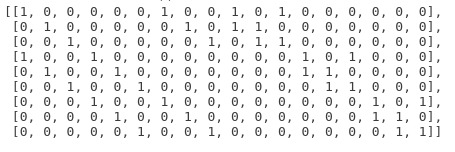
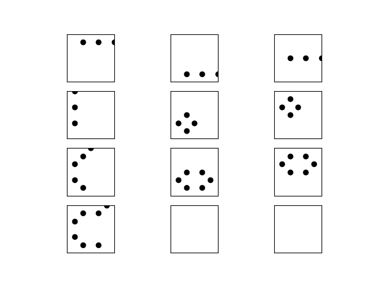

我最近构造一种特殊CSS code，其中涉及到以下操作：取一个classical LDPC $H_X$, 把$\ker(H_X)$重新定义成$H_Z$（也就是取dual code作为$H_Z$）。这样做的坏处是新的$H_Z$的某些行可能是high weight，不再是LDPC。

**问题**：能否对$H_Z$做行变换，使得它的全部或大部分行元素都是LDPC的？

**例子**： $d=3$ toric code

$H_X$:

$H_Z$:

我们采用上述方法，来试图从$H_X$构造出$H_Z$。也就是说，把$\ker H_X$定义成$H_Z$。

我们预期$\ker H_X$中的元素是9个weight 4的plaquette operator和1个weight 3的string operator。然后把9个weight 4的向量定义成$H_Z$。

实际操作中会遇到问题：通过高斯消元解出来的$\ker H_X$里的元素是以上10个元素的线性组合。可视化如下：

是否存在一个efficient算法，能找出$\ker H_X$里weight最小的9个元素？对于更一般的code，比如预期Z stabilizer的数量是2500,qubit的数量是5000，是否能够efficiently找出$ker H_X$里weight最小的2500个元素？

最坏情况下可以通过暴力枚举$2^n$个元素来找weight最小的n个元素。但是否存在一个polynomial的算法？