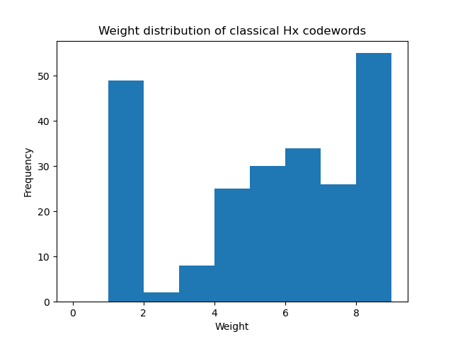
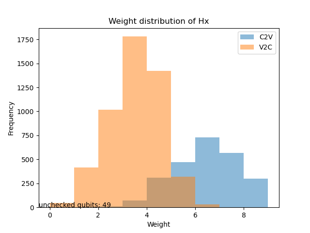
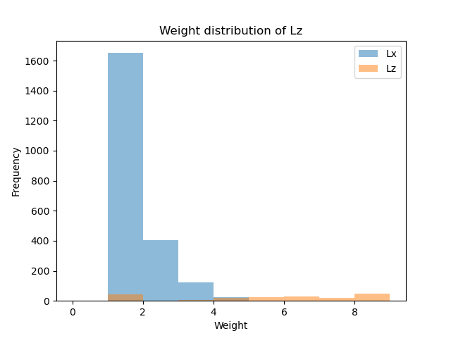

### Starting point of gauging

The input Hx has a weight distribution of codewords as following:

The distributions of the check-to-variable (C2V) and variable-to-check (V2C) degrees are as following:

After including the commuting part of Hz:

Many unchecked qubits in Hx have been fixed, with very few remaining. Introducing Z stabilizers also eliminated the weight 2 logicals for X-checks.

### A conjecture

**Conjecture: after gauging finishes, deleting a weight-b Z stabilizer will actually create a constant logical X with wieght b.**

Studied toric code on 2D sphere. Originally, the model has zero logicals. The model has two redundancies of stabilizer, so $k=e-v-f+2=2-\chi=0$.
Naively thinking: removing a Z stabilizer would cause $k=1$. Turns out removing a Z stabilizer still gives $k=0$.
The reason is that there exists a meta-check for Z stabilizer, removing a single Z stabilizer maintains the balance of the above formula. Further removing a Z stabilizer will cause $k=1$ and $d_Z=4$.

Now, study the genuine 3D code. The input Hx and Hz are both full rank, so I conclude that there's a bug